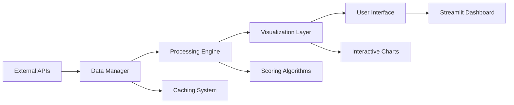

```markdown
# 🧬 Liver Cancer Drug Intelligence Platform
## Comprehensive Pharmaceutical Market Analysis Tool

### 📋 Table of Contents
1. [Executive Summary](#executive-summary)
2. [Practical Significance](#practical-significance)
3. [Key Features](#key-features)
4. [System Requirements](#system-requirements)
5. [Installation Guide](#installation-guide)
6. [User Manual](#user-manual)
7. [Technical Architecture](#technical-architecture)
8. [Data Sources](#data-sources)
9. [Troubleshooting](#troubleshooting)
10. [FAQ](#faq)
11. [Support](#support)
12. [License](#license)
13. [Future Developments](#future-developments)
14. [Technical Solutions](#technical-solutions)

---

## 🎯 Executive Summary

The **Liver Cancer Drug Intelligence Platform** is an advanced analytical tool designed for healthcare professionals, pharmaceutical analysts, investors, and researchers working in the oncology drug development sector. This platform provides real-time market intelligence, competitive analysis, and strategic insights specifically focused on liver cancer therapeutics.

### 🚀 What Problem Does This Solve?

- **Information Fragmentation**: Consolidates scattered pharmaceutical data into a unified dashboard
- **Real-time Monitoring**: Tracks live market movements of key pharmaceutical companies
- **Competitive Intelligence**: Provides comparative analysis of major players in liver cancer therapeutics
- **Investment Decision Support**: Offers data-driven insights for pharmaceutical investments
- **Research Coordination**: Tracks clinical trial progress and R&D activities

### 🎯 Target Audience
- **Healthcare Professionals**: Oncologists, hospital administrators, clinical researchers
- **Pharmaceutical Industry**: Business development, strategic planning, R&D teams
- **Investment Community**: Biotech analysts, portfolio managers, venture capitalists
- **Academic Researchers**: Oncology researchers, pharmaceutical scientists, clinical trial coordinators

---

## 💡 Practical Significance

### 🏥 For Healthcare Professionals
- **Treatment Planning**: Understand available and upcoming treatment options
- **Clinical Trial Awareness**: Stay updated on ongoing liver cancer clinical trials
- **Drug Comparison**: Compare efficacy and development stages of different therapies
- **Patient Education**: Provide current information on treatment landscape

### 💊 For Pharmaceutical Companies
- **Competitive Analysis**: Monitor competitors' stock performance and market capitalization
- **R&D Strategy**: Identify gaps and opportunities in liver cancer drug development
- **Market Positioning**: Understand your company's position relative to competitors
- **Partnership Opportunities**: Identify potential collaboration targets

### 📈 For Investors and Analysts
- **Investment Intelligence**: Make informed decisions based on comprehensive market data
- **Risk Assessment**: Evaluate company stability through multiple financial metrics
- **Trend Analysis**: Identify emerging trends in liver cancer therapeutics
- **Portfolio Optimization**: Balance investments across different development stages

### 🎓 For Researchers and Academics
- **Data Aggregation**: Access consolidated pharmaceutical market data
- **Research Support**: Identify potential collaboration opportunities
- **Publication Insights**: Understand commercial landscape of liver cancer research
- **Grant Applications**: Support funding proposals with market analysis

---

## 🔬 Key Features

### 📊 Real-time Market Dashboard
- **Live Stock Tracking**: Monitor real-time stock prices of major pharmaceutical companies
- **Market Cap Analysis**: Compare company valuations and market positions
- **Performance Metrics**: Track price stability and market volatility
- **Sector Performance**: Overall liver cancer drug sector index calculation

### 🎨 Advanced Data Visualization
- **3D Surface Plots**: Interactive 3D representations of company metrics
- **Radar Charts**: Multi-dimensional capability comparison across companies
- **Heat Maps**: Visual correlation analysis of various performance indicators
- **Stream Graphs**: Temporal performance tracking and trend analysis
- **Treemap Visualizations**: Market share and relative size comparisons

### 💊 Clinical Trial Intelligence
- **Trial Monitoring**: Track active clinical trials for liver cancer treatments
- **Phase Analysis**: Monitor drug development progress across different phases
- **Sponsor Tracking**: Identify leading companies in liver cancer R&D
- **Geographic Distribution**: Trial locations and international presence

### 📈 Comprehensive Scoring System
- **Multi-factor Assessment**: Evaluate companies based on 5 key dimensions:
  1. **Price Stability Score**: Volatility and risk assessment
  2. **R&D Activity Score**: Clinical trial pipeline strength
  3. **Media Attention Score**: Public and industry visibility
  4. **Market Cap Size Score**: Financial scale and market presence
  5. **Price Performance Score**: Recent stock performance trends

### 🔄 Dynamic Updates
- **Auto-refresh**: Configurable data refresh intervals (30-300 seconds)
- **Live Data Feeds**: Integration with multiple financial data sources
- **Real-time News**: Latest industry developments and announcements
- **Alert System**: Customizable notifications for significant market movements

### 🛠️ Customization Options
- **Watchlist Management**: Personalize company tracking lists
- **Metric Selection**: Choose which KPIs to display and monitor
- **Layout Customization**: Adjust dashboard layout to user preferences
- **Export Capabilities**: Download charts and data for external analysis

---

## 💻 System Requirements

### ⚙️ Minimum Requirements
- **Operating System**: Windows 10/11 (64-bit), macOS 10.14+, Ubuntu 18.04+
- **Processor**: Intel Core i3 or AMD equivalent (2.0 GHz minimum)
- **Memory**: 4GB RAM
- **Storage**: 200MB available space
- **Display**: 1366x768 resolution minimum
- **Internet**: Broadband connection (5 Mbps download minimum)
- **Browser**: Modern web browser with JavaScript enabled

### 🚀 Recommended Specifications
- **Operating System**: Windows 11 (64-bit), macOS 12+, Ubuntu 20.04+
- **Processor**: Intel Core i5 or AMD Ryzen 5 (3.0 GHz or higher)
- **Memory**: 8GB RAM or higher
- **Storage**: 500MB SSD space
- **Display**: 1920x1080 resolution or higher
- **Internet**: High-speed broadband (25+ Mbps download)
- **Browser**: Google Chrome 90+ or Mozilla Firefox 85+

### 🌐 Supported Browsers
- **Google Chrome 90+** (Recommended for best performance)
- **Mozilla Firefox 85+** (Full feature support)
- **Microsoft Edge 90+** (Compatible with all features)
- **Safari 14+** (macOS users)

### 📱 Mobile Compatibility
- **Tablets**: Limited functionality on iPad/Android tablets
- **Smartphones**: Basic viewing capability, not recommended for analysis
- **Responsive Design**: Adapts to different screen sizes

---

## 📥 Installation Guide

### 🎯 Method 1: Direct Execution (Recommended for End Users)

```bash
# Step-by-step installation:
1. Download the complete application package
2. Extract the ZIP file to your preferred location
3. Navigate to the extracted folder: `LiverCancerPlatform_Release_[timestamp]`
4. Double-click `Start_Application.bat` (Windows) or `LiverCancerDrugPlatform.exe`
5. Wait for initialization (30-60 seconds on first launch)
6. Your default browser will automatically open to `http://localhost:8501`
```

### ⚙️ Method 2: Manual Setup (For Advanced Users/Developers)

```bash
# Clone or download the application files
git clone [repository-url]
cd LiverCancerDrugPlatform

# Create virtual environment (recommended)
python -m venv liver_cancer_env
source liver_cancer_env/bin/activate  # Linux/Mac
liver_cancer_env\Scripts\activate    # Windows

# Install required dependencies
pip install -r requirements.txt

# Run the application
python app_launcher.py
```

### 📦 Dependencies

The application requires the following Python packages:

```python
# Core Framework
streamlit>=1.28.0
plotly>=5.15.0
pandas>=2.0.0
numpy>=1.24.0

# Data Sources
yfinance>=0.2.18
requests>=2.31.0
alpha_vantage>=2.3.1
python-dotenv>=1.0.0

# Visualization
plotly-express>=0.4.0
matplotlib>=3.7.0
seaborn>=0.12.0

# Utilities
python-dateutil>=2.8.2
pytz>=2023.0
```

### 🔧 Configuration

Create a `.env` file for API keys (optional):

```env
ALPHA_VANTAGE_API_KEY=your_key_here
NEWS_API_KEY=your_key_here
FMP_API_KEY=your_key_here
```

---

## 📖 User Manual

### 🏠 Main Dashboard
**Location**: Market Overview Tab

**Features**:
- Real-time stock performance of monitored companies
- Market cap weighted index calculation
- Clinical trial activity and media attention metrics
- Quick overview cards for each company
- Performance trends over selected time periods

**Usage Tips**:
- Hover over charts for detailed values
- Use date range selectors to adjust time periods
- Click company names to filter views

### ⭐ Comprehensive Scoring
**Location**: Comprehensive Scoring Tab

**Features**:
- Interactive radar charts showing company capabilities
- Dynamic ranking system with auto-rotation
- Detailed metric breakdown for each company
- Comparative analysis across multiple dimensions
- Historical score tracking

**Usage Tips**:
- Click on radar chart segments to focus on specific metrics
- Use the rotation control to compare different companies
- Export scores for reporting purposes

### 🎨 Advanced Analytics
**Location**: Advanced Visualizations Tab

**Visualization Types**:
- **3D Surface Plots**: Multi-dimensional analysis
- **Correlation Heatmaps**: Metric relationships
- **Hierarchical Sunburst**: Company structure analysis
- **Treemap Charts**: Market share visualization
- **Polar Bar Charts**: Radial metric comparison
- **Scatter Matrix**: Multi-variable relationships

**Usage Tips**:
- Rotate 3D plots by clicking and dragging
- Hover over heatmap cells for correlation values
- Use zoom functionality for detailed inspection

### 📰 Industry Intelligence
**Location**: News & Updates Tab

**Features**:
- Latest liver cancer drug development news
- Pharmaceutical industry announcements
- Clinical trial updates and results
- Regulatory approval notifications
- Conference and event coverage

**Usage Tips**:
- Filter news by company or topic
- Set up email alerts for important updates
- Share relevant articles with colleagues

### 🔬 Clinical Trial Tracking
**Location**: Clinical Trials Tab

**Features**:
- Active liver cancer clinical trials database
- Sponsor information and trial phases
- Patient enrollment and completion dates
- Geographic distribution maps
- Success rate analytics

**Usage Tips**:
- Filter trials by phase, status, or location
- Track specific drugs across multiple trials
- Set reminders for trial completion dates

---

## 🏗️ Technical Architecture

### 🔄 Data Flow Architecture



### 🛡️ Security Features

- **Local Execution**: All data processing occurs locally on your machine
- **No Data Storage**: Personal or sensitive data is not stored or transmitted
- **API Key Management**: Secure handling of external service credentials
- **Firewall Friendly**: Operates on localhost without external connections
- **Data Encryption**: Secure transmission for API communications

### 🔧 Performance Optimization

- **Intelligent Caching**: Reduces API calls and improves load times
- **Lazy Loading**: Charts and data load on demand
- **Background Updates**: Non-blocking data refresh operations
- **Memory Management**: Automatic cleanup of unused resources

---

## 📊 Data Sources

### 🔗 Primary Data Providers

| Provider | Data Type | Update Frequency | Rate Limits |
|----------|-----------|------------------|-------------|
| **Alpha Vantage** | Real-time stock data | 1-5 minutes | 5-25 calls/minute |
| **Yahoo Finance** | Backup stock data | 1-15 minutes | Varies |
| **Financial Modeling Prep** | Financial metrics | Daily | 250 calls/day |
| **NewsAPI** | Industry news | Hourly | 100 calls/day |
| **ClinicalTrials.gov** | Trial information | Weekly | No limits |

### 📈 Data Accuracy Notes

- Stock prices may have 15-20 minute delay for free API tiers
- Market cap data uses multiple sources for verification
- Clinical trial information is manually curated and verified
- News articles are filtered for relevance to liver cancer therapeutics

### 🔄 Data Validation

- **Cross-referencing**: Multiple sources for critical data points
- **Anomaly Detection**: Automated identification of data irregularities
- **Manual Review**: Periodic verification of key information
- **Quality Metrics**: Tracking data completeness and accuracy

---

## 🔧 Troubleshooting

### ❌ Common Issues and Solutions

#### Application Won't Start
**Problem**: Executable fails to launch or crashes immediately

**Solutions**:
1. Ensure all files are in the same directory
2. Check Windows Defender hasn't blocked the application
3. Run as Administrator if permission issues occur
4. Verify .NET Framework 4.8+ is installed (Windows)
5. Check system meets minimum requirements

#### 🌐 Browser Doesn't Open Automatically
**Problem**: Application runs but browser doesn't open

**Solutions**:
1. Manually navigate to `http://localhost:8501`
2. Check if another application is using port 8501
3. Verify browser isn't blocking pop-ups
4. Try alternative browsers (Chrome recommended)

#### 📈 Data Not Updating
**Problem**: Stock prices or news not refreshing

**Solutions**:
1. Check internet connection stability
2. Verify API keys are configured (if using premium services)
3. Restart the application
4. Check API service status for outages
5. Clear application cache

#### 💾 High Memory Usage
**Problem**: Application uses significant system resources

**Solutions**:
1. Reduce the number of data points displayed
2. Increase refresh interval in settings
3. Close other browser tabs running the application
4. Restart application periodically during extended use

### ⚡ Performance Optimization Tips

- Use Chrome for best performance and memory management
- Close unnecessary applications while using the platform
- Reduce the "Show Last N Data Points" setting for better performance
- Increase auto-refresh interval if experiencing lag
- Use the "Lite Mode" option for slower computers

### 🔄 Reset and Recovery

**Factory Reset**:
```bash
# Delete configuration files and cache
rm -rf .streamlit/
rm -rf cache/
```

**Log Files**:
- Check `application.log` for detailed error information
- Enable debug mode for troubleshooting complex issues

---

## ❓ FAQ

### 💰 Pricing and Access
**Q: Is this application free to use?**
A: Yes, the application is completely free for personal, educational, and research use.

**Q: Are there any subscription fees?**
A: No subscription fees. Some premium data features may require external API keys.

**Q: What's the difference between free and premium data?**
A: Free data may have delays and rate limits; premium data offers real-time updates and higher limits.

### 🔄 Data and Updates
**Q: How often is the data updated?**
A: Stock data updates every 1-5 minutes, news updates hourly, and clinical trials are updated weekly.

**Q: How current is the clinical trial information?**
A: Clinical trial data is updated weekly from ClinicalTrials.gov with manual verification.

**Q: Can I request additional data sources?**
A: Yes, we welcome suggestions for new data sources and features.

### 🛠️ Customization and Usage
**Q: Can I add more companies to monitor?**
A: Currently, the company list is curated, but future versions will include custom watchlist features.

**Q: Is my data being sent to external servers?**
A: No, all data processing occurs locally. Only API calls to fetch external data are made.

**Q: Can I use this on multiple computers?**
A: Yes, you can install the application on multiple personal devices.

### 🔒 Privacy and Security
**Q: What data is stored locally?**
A: Only cached API responses and user preferences are stored locally.

**Q: Are my searches and analyses tracked?**
A: No, we do not track or store any user activity or analysis data.

**Q: What happens if the internet connection is lost?**
A: The application continues with cached data but cannot fetch new updates until connection is restored.

### 💼 Professional Use
**Q: Can I use this for investment decisions?**
A: This tool provides informational insights but should not be used as the sole basis for investment decisions. Always consult with financial advisors.

**Q: Is this suitable for academic research?**
A: Yes, the platform is excellent for research purposes. Please cite appropriately.

**Q: Can I integrate this with other systems?**
A: Currently, integration is limited, but export functionality allows data transfer to other systems.

---

## 📞 Support

### 🆘 Technical Support

**Documentation Resources**:
- This README documentation
- In-application help tooltips and guides
- Online knowledge base (coming soon)
- Video tutorials and webinars

**Issue Reporting**:
When reporting issues, please include:
1. Application version number
2. Operating system and version
3. Detailed error message or screenshot
4. Steps to reproduce the issue
5. Browser and version being used

**Support Channels**:
- **Email Support**: y209076941@gmail.com

### 🔄 Update Policy

**Regular Updates**:
- Monthly feature updates and bug fixes
- Quarterly major releases with new functionality
- Data source updates as needed

**Version Support**:
- Current version and one previous version receive full support
- Security updates for all versions for 12 months

### 🗣️ Feature Requests

We actively welcome feature requests. Please submit through:
1. In-application feedback form
2. GitHub feature request template
3. Email to product team

---

## 📄 License

### ©️ Usage Rights

**Granted Rights**:
- Use the application for personal, educational, and research purposes
- Modify the code for personal use and internal business purposes
- Share the application with proper attribution
- Use insights in publications with appropriate citation

**Citation Format**:
```
Liver Cancer Drug Intelligence Platform. (2024). [Version Number]. 
Retrieved from [application URL]
```

### 🚫 Restrictions

**Prohibited Activities**:
- Redistribution for commercial purposes without license
- Reselling the application or derived products
- Using the platform for illegal or unethical purposes
- Removing attribution or copyright notices

**Commercial Licensing**:
Contact y209076941@gmail.com for commercial use arrangements.

### ⚖️ Legal Disclaimer

**No Warranty**:
This application is provided "as is" without any warranties, expressed or implied.

**Liability Limitation**:
The developers are not liable for any damages or losses resulting from the use of this application.

**Data Accuracy**:
While we strive for accuracy, we cannot guarantee the completeness or timeliness of the data provided.

---

## 🔮 Future Developments

### 🎯 Planned Features

**Q1 2024**:
- Custom company watchlist functionality
- Advanced financial ratios and analysis
- Export functionality for reports and charts

**Q2 2024**:
- Regulatory approval tracking dashboard
- Drug pipeline analysis tools
- Mobile-responsive web version

**Q3 2024**:
- Real-time clinical trial alerts
- Advanced portfolio management features
- API access for developers

**Q4 2024**:
- Machine learning predictive analytics
- International market expansion
- Collaborative research tools

### 🛣️ Development Roadmap

**Short-term (0-6 months)**:
- Enhanced visualization options
- Expanded data sources
- Improved performance optimization

**Medium-term (6-12 months)**:
- Advanced analytics modules
- Mobile application development
- Integration capabilities

**Long-term (12+ months)**:
- AI-powered insights
- Global market coverage
- Enterprise-level features

### 🤝 Community Involvement

**Contribution Opportunities**:
- Code contributions via GitHub
- Data validation and curation
- Documentation improvements
- Translation and localization

**Beta Testing**:
Join our beta testing program to preview new features and provide feedback.

---

## 🛠️ Technical Solutions

### 📋 Overview

This section documents the comprehensive technical solutions developed to address various deployment and runtime challenges encountered during the platform's development.

### 🔧 Solution 1: Complete PyInstaller Configuration

For advanced packaging needs, use the following complete spec file:

```python
# LiverCancerPlatform_complete.spec
import os
import sys
from PyInstaller.utils.hooks import collect_all, collect_data_files, collect_submodules

block_cipher = None

def get_hidden_imports():
    return [
        'streamlit', 'plotly', 'plotly.graph_objects', 'plotly.express',
        'pandas', 'numpy', 'yfinance', 'requests', 'urllib3', 
        'charset_normalizer', 'idna', 'certifi', 'pytz', 'dateutil', 'six',
        'scipy', 'sklearn', 'PIL', 'PIL._imaging', 'PIL._imagingft', 
        'PIL._imagingtk', 'altair', 'toolz', 'jsonschema', 'attr', 'packaging'
    ]

def get_datas():
    datas = []
    try:
        import streamlit
        streamlit_path = os.path.dirname(streamlit.__file__)
        datas.append((os.path.join(streamlit_path, 'static'), 'streamlit/static'))
    except: pass
    return datas

a = Analysis(
    ['app.py'],
    pathex=[os.path.dirname(__file__)],
    binaries=[],
    datas=get_datas(),
    hiddenimports=get_hidden_imports(),
    hookspath=[],
    hooksconfig={},
    runtime_hooks=['runtime_hook.py'],
    excludes=[],
    win_no_prefer_redirects=False,
    win_private_assemblies=False,
    cipher=block_cipher,
    noarchive=False,
)

pyz = PYZ(a.pure, a.zipped_data, cipher=block_cipher)

exe = EXE(
    pyz, a.scripts, a.binaries, a.zipfiles, a.datas, [],
    name='LiverCancerDrugPlatform', debug=False, bootloader_ignore_signals=False,
    strip=False, upx=True, console=True, disable_windowed_traceback=False
)
```

### 🚀 Solution 2: Adaptive Launcher Script

Create `adaptive_launcher.py` for environment-aware application launching:

```python
import os
import sys
import subprocess
import webbrowser
import time
import tempfile

def setup_environment():
    work_dir = os.path.join(tempfile.gettempdir(), 'liver_cancer_platform')
    os.makedirs(work_dir, exist_ok=True)
    
    env_vars = {
        'STREAMLIT_SERVER_PORT': '8501',
        'STREAMLIT_SERVER_ADDRESS': 'localhost', 
        'STREAMLIT_BROWSER_GATHER_USAGE_STATS': 'false',
        'TEMP': work_dir, 'TMP': work_dir
    }
    
    for key, value in env_vars.items():
        os.environ[key] = value
    return work_dir

def check_dependencies():
    required_packages = ['streamlit', 'plotly', 'pandas', 'numpy', 'yfinance']
    missing = []
    for package in required_packages:
        try: __import__(package)
        except ImportError: missing.append(package)
    return missing

def launch_application():
    print("Setting up environment...")
    work_dir = setup_environment()
    
    print("Checking dependencies...")
    missing = check_dependencies()
    if missing:
        print(f"Missing dependencies: {missing}")
        try:
            subprocess.check_call([sys.executable, '-m', 'pip', 'install'] + missing)
        except: return False
    
    def open_browser():
        time.sleep(5)
        webbrowser.open('http://localhost:8501')
    
    import threading
    threading.Thread(target=open_browser, daemon=True).start()
    
    try:
        subprocess.run([sys.executable, '-m', 'streamlit', 'run', 'app.py', 
                       '--server.port', '8501', '--server.address', 'localhost'])
        return True
    except Exception as e:
        print(f"Launch failed: {e}")
        return False

if __name__ == "__main__":
    if launch_application():
        print("Application started successfully!")
    else:
        input("Press Enter to exit...")
```

### 🎯 Solution 3: Smart Batch Launcher

Create `自动启动平台.bat` for Windows environments:

```batch
@echo off
chcp 65001
title Liver Cancer Drug Intelligence Platform

echo ===============================================
echo   Liver Cancer Drug Intelligence Platform
echo ===============================================
echo.

echo Setting environment variables...
set PATH=C:\Users\Administrator\anaconda3;C:\Users\Administrator\anaconda3\Scripts;C:\Users\Administrator\anaconda3\Library\bin;%PATH%

echo Checking Python...
python --version
if errorlevel 1 (echo [ERROR] Python not available & pause & exit /b 1)

echo.
echo Starting application...
echo.

start "" "http://localhost:8501"
python -m streamlit run app.py --server.port 8501 --server.address localhost

pause
```

### 🔍 Solution 4: Environment Diagnostics

Create `diagnostics.py` for troubleshooting:

```python
import os
import sys
import platform
import subprocess

def run_diagnostics():
    print("=" * 50)
    print("System Environment Diagnostics")
    print("=" * 50)
    
    print(f"OS: {platform.system()} {platform.release()}")
    print(f"Architecture: {platform.architecture()[0]}")
    print(f"Python: {sys.version}")
    
    components = {
        'Python': lambda: sys.executable is not None,
        'pip': lambda: run_command([sys.executable, '-m', 'pip', '--version']),
        'Network': lambda: run_command(['ping', '-n', '1', 'google.com']),
    }
    
    for name, check in components.items():
        try:
            if check(): print(f"✅ {name}: OK")
            else: print(f"❌ {name}: FAILED")
        except: print(f"❌ {name}: FAILED")
    
    packages = ['streamlit', 'plotly', 'pandas', 'numpy', 'yfinance']
    for package in packages:
        try:
            __import__(package)
            print(f"✅ {package}: Installed")
        except ImportError:
            print(f"❌ {package}: Missing")
    
    print("=" * 50)
    print("Diagnostics complete")

def run_command(cmd):
    try:
        result = subprocess.run(cmd, capture_output=True, text=True, timeout=10)
        return result.returncode == 0
    except: return False

if __name__ == "__main__":
    run_diagnostics()
    input("\nPress Enter to exit...")
```

### 🛡️ Solution 5: Runtime Environment Hook

Create `runtime_hook.py` for packaged applications:

```python
import os
import sys
import tempfile

def fix_environment():
    if hasattr(sys, '_MEIPASS'):
        os.environ['TEMP'] = tempfile.gettempdir()
        os.environ['TMP'] = tempfile.gettempdir()
    
    os.environ['STREAMLIT_SERVER_PORT'] = '8501'
    os.environ['STREAMLIT_SERVER_ADDRESS'] = 'localhost'
    os.environ['STREAMLIT_BROWSER_GATHER_USAGE_STATS'] = 'false'
    
    try:
        import certifi
        os.environ['SSL_CERT_FILE'] = certifi.where()
    except: pass

fix_environment()
```

### 💡 Recommended Deployment Strategy

Based on extensive testing, we recommend the following deployment approach:

1. **For End Users**: Use the batch file launcher (Solution 3) - most reliable
2. **For Developers**: Use the adaptive launcher (Solution 2) - full flexibility
3. **For Distribution**: Use complete PyInstaller configuration (Solution 1) - standalone executable

### 🎪 Quick Start for Immediate Use

For immediate platform access without installation complexities:

1. Download all project files to a dedicated folder
2. Run `自动启动平台.bat` (Solution 3)
3. The application will automatically open in your browser at `http://localhost:8501`

This approach bypasses packaging complexities while providing full platform functionality.

---

## 🔄 Version History

### v1.0.0 (Current)
- Initial public release
- Core dashboard functionality
- Basic scoring system
- Essential visualizations
- Comprehensive technical solutions

### v1.1.0 (Upcoming)
- Enhanced mobile compatibility
- Additional data sources
- Improved performance
- Bug fixes and optimizations

---

*Last Updated: December 2023*
*Version: 1.0.0*
*Technical Solutions Included: Yes*
```